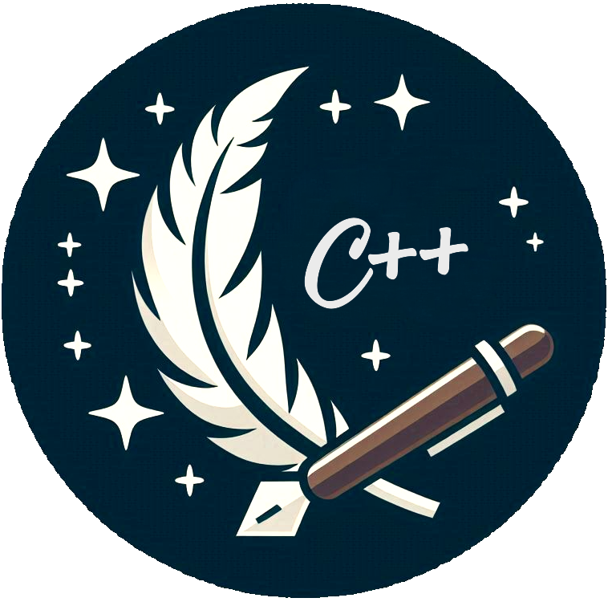

<div align="center">
  <br>
  
  <h1>Quill</h1>

  <p><b>Asynchronous Low Latency C++ Logging Library</b></p>

  <div>
    <a href="https://github.com/odygrd/quill/actions?query=workflow%3Alinux">
      
    </a>
    <a href="https://github.com/odygrd/quill/actions?query=workflow%3Amacos">
      
    </a>
    <a href="https://github.com/odygrd/quill/actions?query=workflow%3Awindows">
      
    </a>
  </div>

  <div>
    <a href="https://codecov.io/gh/odygrd/quill">
      
    </a>
    <a href="https://app.codacy.com/gh/odygrd/quill/dashboard?utm_source=gh&utm_medium=referral&utm_content=&utm_campaign=Badge_grade">
      
    </a>
    <a href="https://www.codefactor.io/repository/github/odygrd/quill">
      
     </a>
  </div>

  <div>
    <a href="https://opensource.org/licenses/MIT">
      
    </a>
    <a href="https://en.wikipedia.org/wiki/C%2B%2B17">
      
    </a>
  </div>

<h4>
    <a href="https://quillcpp.readthedocs.io" title="Explore the full documentation">📚 Documentation</a>
  <span> · </span>
    <a href="https://quillcpp.readthedocs.io/en/latest/cheat_sheet.html" title="Quick reference for common tasks">⚡ Cheat Sheet</a>
  <span> · </span>
    <a href="https://github.com/odygrd/quill/issues/new?assignees=&labels=&projects=&template=bug-report.md&title=" title="Report a bug or issue">🐛 Report Bug</a>
  <span> · </span>
    <a href="https://github.com/odygrd/quill/issues/new?assignees=&labels=&projects=&template=feature_request.md&title=">💡 Request Feature</a>
  </h4>

<div align="center"></div>

</div>

## 🧭 Table of Contents

- [Introduction](#-introduction)
- [Quick Start](#-quick-start)
- [Features](#-features)
- [Performance](#-performance)
- [Usage](#-usage)
- [Design](#-design)
- [Caveats](#-caveats)
- [License](#-license)

## ✨ Introduction

Quill is a high-performance asynchronous logging library. It is particularly suited for performance-critical
applications where every microsecond counts.

- **Performance-Focused**: Quill consistently outperforms many popular logging libraries.
- **Feature-Rich**: Packed with advanced features to meet diverse logging needs.
- **Battle-Tested**: Proven in demanding production environments.
- **Extensive Documentation**: Comprehensive guides and examples available.
- **Community-Driven**: Open to contributions, feedback, and feature requests.

Try it on [Compiler Explorer](https://godbolt.org/z/v1oa7Y3dY)

## ⏩ Quick Start

Getting started is easy and straightforward. Follow these steps to integrate the library into your project:

### Installation

You can install Quill using the package manager of your choice:

| Package Manager |              Installation Command              |
|:---------------:|:----------------------------------------------:|
|      vcpkg      |             `vcpkg install quill`              |
|      Conan      |             `conan install quill`              |
|    Homebrew     |              `brew install quill`              |
|  Meson WrapDB   |           `meson wrap install quill`           |
|      Conda      |      `conda install -c conda-forge quill`      |
|     Bzlmod      | `bazel_dep(name = "quill", version = "x.y.z")` |
|      xmake      |             `xrepo install quill`              |
|       nix       |            `nix-shell -p quill-log`            |

### Setup

Once installed, you can start using Quill with the following code:

```c++
#include "quill/Backend.h"
#include "quill/Frontend.h"
#include "quill/LogMacros.h"
#include "quill/Logger.h"
#include "quill/sinks/ConsoleSink.h"
#include <string_view>

int main()
{
  quill::Backend::start();

  quill::Logger* logger = quill::Frontend::create_or_get_logger(
    "root", quill::Frontend::create_or_get_sink<quill::ConsoleSink>("sink_id_1"));

  LOG_INFO(logger, "Hello from {}!", std::string_view{"Quill"});
}
```

## 🎯 Features

- **High-Performance**: Ultra-low latency performance. View [Benchmarks](http://github.com/odygrd/quill#performance)
- **Asynchronous Processing**: Background thread handles formatting and I/O, keeping your main thread responsive.
- **Minimal Header Includes**:
  - **Frontend**: Only `Logger.h` and `LogMacros.h` needed for logging. Lightweight with minimal dependencies.
  - **Backend**: Single `.cpp` file inclusion. No backend code injection into other translation units.
- **Compile-Time Optimization**: Eliminate specific log levels at compile time.
- **Custom Formatters**: Define your own log output patterns.
  See [Formatters](https://quillcpp.readthedocs.io/en/latest/formatters.html).
- **Timestamp-Ordered Logs**: Simplify debugging of multithreaded applications with chronologically ordered logs.
- **Flexible Timestamps**: Support for `rdtsc`, `chrono`, or `custom clocks` - ideal for simulations and more.
- **Backtrace Logging**: Store messages in a ring buffer for on-demand display.
  See [Backtrace Logging](https://quillcpp.readthedocs.io/en/latest/backtrace_logging.html)
- **Multiple Output Sinks**: Console (with color), files (with rotation), JSON, ability to create custom sinks and more.
- **Log Filtering**: Process only relevant messages.
  See [Filters](https://quillcpp.readthedocs.io/en/latest/filters.html).
- **JSON Logging**: Structured log output.
  See [JSON Logging](https://quillcpp.readthedocs.io/en/latest/json_logging.html)
- **Configurable Queue Modes**: `bounded/unbounded` and `blocking/dropping` options with monitoring on dropped messages,
  queue reallocations, and blocked hot threads.
- **Crash Handling**: Built-in signal handler for log preservation during crashes.
- **Huge Pages Support (Linux)**: Leverage huge pages on the hot path for optimized performance.
- **Wide Character Support (Windows)**: Compatible with ASCII-encoded wide strings and STL containers consisting of wide
  strings.
- **Exception-Free Option**: Configurable builds with or without exception handling.
- **Clean Codebase**: Maintained to high standards, warning-free even at strict levels.
- **Type-Safe API**: Built on [{fmt}](http://github.com/fmtlib/fmt) library.

## 🚀 Performance

### System Configuration

- **OS:** Linux RHEL 9.4
- **CPU:** Intel Core i5-12600 (12th Gen) @ 4.8 GHz
- **Compiler:** GCC 13.1
- **Benchmark-Tuned System:** The system is specifically tuned for benchmarking.

- **Command Line Parameters:**
  ```shell
  $ cat /proc/cmdline
  BOOT_IMAGE=(hd0,gpt2)/vmlinuz-5.14.0-427.13.1.el9_4.x86_64 root=/dev/mapper/rhel-root ro crashkernel=1G-4G:192M,4G-64G:256M,64G-:512M resume=/dev/mapper/rhel-swap rd.lvm.lv=rhel/root rd.lvm.lv=rhel/swap rhgb quiet nohz=on nohz_full=1-5 rcu_nocbs=1-5 isolcpus=1-5 mitigations=off transparent_hugepage=never intel_pstate=disable nosoftlockup irqaffinity=0 processor.max_cstate=1 nosoftirqd sched_tick_offload=0 spec_store_bypass_disable=off spectre_v2=off iommu=pt
  ```

### Latency

The results presented in the tables below are measured in `nanoseconds (ns)`.

The tables are sorted by the 95th percentile

#### Logging Numbers

`LOG_INFO(logger, "Logging int: {}, int: {}, double: {}", i, j, d)`.

##### 1 Thread Logging

| Library                                                        | 50th | 75th | 90th | 95th | 99th | 99.9th |
|----------------------------------------------------------------|:----:|:----:|:----:|:----:|:----:|:------:|
| [Quill Bounded Dropping Queue](http://github.com/odygrd/quill) |  7   |  8   |  8   |  9   |  9   |   11   |
| [fmtlog](http://github.com/MengRao/fmtlog)                     |  9   |  9   |  10  |  10  |  12  |   13   |
| [Quill Unbounded Queue](http://github.com/odygrd/quill)        |  10  |  10  |  10  |  10  |  12  |   14   |
| [PlatformLab NanoLog](http://github.com/PlatformLab/NanoLog)   |  13  |  14  |  16  |  17  |  19  |   25   |
| [MS BinLog](http://github.com/Morgan-Stanley/binlog)           |  21  |  21  |  22  |  22  |  56  |   93   |
| [XTR](https://github.com/choll/xtr)                            |  7   |  7   |  29  |  30  |  33  |   53   |
| [Reckless](http://github.com/mattiasflodin/reckless)           |  26  |  28  |  31  |  32  |  35  |   49   |
| [Iyengar NanoLog](http://github.com/Iyengar111/NanoLog)        |  83  |  96  | 117  | 125  | 152  |  197   |
| [spdlog](http://github.com/gabime/spdlog)                      | 143  | 147  | 152  | 158  | 165  |  177   |
| [g3log](http://github.com/KjellKod/g3log)                      | 1161 | 1259 | 1329 | 1419 | 1602 |  1827  |

##### 4 Threads Logging Simultaneously

| Library                                                        | 50th | 75th | 90th | 95th | 99th | 99.9th |
|----------------------------------------------------------------|:----:|:----:|:----:|:----:|:----:|:------:|
| [fmtlog](http://github.com/MengRao/fmtlog)                     |  8   |  9   |  9   |  10  |  11  |   13   |
| [Quill Bounded Dropping Queue](http://github.com/odygrd/quill) |  8   |  9   |  10  |  10  |  12  |   14   |
| [XTR](https://github.com/choll/xtr)                            |  7   |  8   |  9   |  11  |  31  |   38   | 
| [Quill Unbounded Queue](http://github.com/odygrd/quill)        |  10  |  11  |  11  |  12  |  13  |   15   |
| [PlatformLab NanoLog](http://github.com/PlatformLab/NanoLog)   |  15  |  17  |  20  |  23  |  27  |   32   |
| [Reckless](http://github.com/mattiasflodin/reckless)           |  19  |  23  |  26  |  28  |  34  |   55   |
| [MS BinLog](http://github.com/Morgan-Stanley/binlog)           |  21  |  22  |  22  |  23  |  62  |  100   |
| [Iyengar NanoLog](http://github.com/Iyengar111/NanoLog)        |  58  |  90  | 123  | 131  | 168  |  242   |
| [spdlog](http://github.com/gabime/spdlog)                      | 210  | 243  | 288  | 313  | 382  |  694   |
| [g3log](http://github.com/KjellKod/g3log)                      | 1271 | 1337 | 1396 | 1437 | 1614 |  1899  |

#### Logging Large Strings

Logging `std::string` over 35 characters to prevent the short string optimization.

`LOG_INFO(logger, "Logging int: {}, int: {}, string: {}", i, j, large_string)`.

##### 1 Thread Logging

| Library                                                        | 50th | 75th | 90th | 95th | 99th | 99.9th |
|----------------------------------------------------------------|:----:|:----:|:----:|:----:|:----:|:------:|
| [Quill Bounded Dropping Queue](http://github.com/odygrd/quill) |  11  |  13  |  13  |  14  |  15  |   16   |
| [fmtlog](http://github.com/MengRao/fmtlog)                     |  11  |  12  |  13  |  14  |  15  |   17   |
| [Quill Unbounded Queue](http://github.com/odygrd/quill)        |  14  |  15  |  16  |  17  |  18  |   19   |
| [MS BinLog](http://github.com/Morgan-Stanley/binlog)           |  22  |  23  |  24  |  25  |  61  |  100   |
| [PlatformLab NanoLog](http://github.com/PlatformLab/NanoLog)   |  15  |  17  |  21  |  27  |  33  |   39   |
| [XTR](https://github.com/choll/xtr)                            |  8   |  9   |  29  |  31  |  35  |   54   |
| [Reckless](http://github.com/mattiasflodin/reckless)           |  91  | 107  | 115  | 118  | 124  |  135   |
| [Iyengar NanoLog](http://github.com/Iyengar111/NanoLog)        |  86  |  97  | 119  | 128  | 159  |  268   |
| [spdlog](http://github.com/gabime/spdlog)                      | 120  | 124  | 128  | 132  | 141  |  151   |
| [g3log](http://github.com/KjellKod/g3log)                      | 881  | 956  | 1018 | 1089 | 1264 |  1494  |

##### 4 Threads Logging Simultaneously

| Library                                                        | 50th | 75th | 90th | 95th | 99th | 99.9th |
|----------------------------------------------------------------|:----:|:----:|:----:|:----:|:----:|:------:|
| [XTR](https://github.com/choll/xtr)                            |  9   |  11  |  13  |  14  |  32  |   40   |
| [fmtlog](http://github.com/MengRao/fmtlog)                     |  11  |  12  |  13  |  14  |  16  |   19   |
| [Quill Bounded Dropping Queue](http://github.com/odygrd/quill) |  13  |  14  |  15  |  16  |  17  |   19   |
| [Quill Unbounded Queue](http://github.com/odygrd/quill)        |  15  |  16  |  17  |  18  |  19  |   21   |
| [MS BinLog](http://github.com/Morgan-Stanley/binlog)           |  23  |  25  |  27  |  28  |  65  |  105   |
| [PlatformLab NanoLog](http://github.com/PlatformLab/NanoLog)   |  16  |  20  |  32  |  38  |  44  |   51   |
| [Reckless](http://github.com/mattiasflodin/reckless)           |  79  |  94  | 104  | 107  | 114  |  132   |
| [Iyengar NanoLog](http://github.com/Iyengar111/NanoLog)        |  85  |  93  | 125  | 133  | 168  |  237   |
| [spdlog](http://github.com/gabime/spdlog)                      | 178  | 218  | 261  | 281  | 381  |  651   |
| [g3log](http://github.com/KjellKod/g3log)                      | 992  | 1055 | 1121 | 1178 | 1360 |  1600  |

#### Logging Complex Types

Logging `std::vector<std::string>` containing 16 large strings, each ranging from 50 to 60 characters.

`LOG_INFO(logger, "Logging int: {}, int: {}, vector: {}", i, j, v)`.

##### 1 Thread Logging

| Library                                                        | 50th | 75th | 90th | 95th | 99th | 99.9th |
|----------------------------------------------------------------|:----:|:----:|:----:|:----:|:----:|:------:|
| [Quill Bounded Dropping Queue](http://github.com/odygrd/quill) |  48  |  50  |  53  |  55  |  58  |   62   |
| [Quill Unbounded Queue](http://github.com/odygrd/quill)        |  54  |  56  |  57  |  58  |  61  |   66   |
| [MS BinLog](http://github.com/Morgan-Stanley/binlog)           |  68  |  69  |  72  |  74  |  79  |  281   |
| [XTR](https://github.com/choll/xtr)                            | 284  | 294  | 340  | 346  | 356  |  575   |
| [fmtlog](http://github.com/MengRao/fmtlog)                     | 711  | 730  | 754  | 770  | 804  |  834   |
| [spdlog](http://github.com/gabime/spdlog)                      | 6191 | 6261 | 6330 | 6386 | 6633 |  7320  |

##### 4 Threads Logging Simultaneously

| Library                                                        | 50th | 75th | 90th | 95th | 99th | 99.9th |
|----------------------------------------------------------------|:----:|:----:|:----:|:----:|:----:|:------:|
| [Quill Bounded Dropping Queue](http://github.com/odygrd/quill) |  50  |  52  |  54  |  56  |  60  |   82   |
| [MS BinLog](http://github.com/Morgan-Stanley/binlog)           |  70  |  72  |  75  |  79  |  88  |  286   |
| [Quill Unbounded Queue](http://github.com/odygrd/quill)        |  97  | 107  | 116  | 122  | 135  |  148   |
| [XTR](https://github.com/choll/xtr)                            | 512  | 711  | 761  | 791  | 865  |  945   |
| [fmtlog](http://github.com/MengRao/fmtlog)                     | 780  | 804  | 823  | 835  | 860  |  896   |
| [spdlog](http://github.com/gabime/spdlog)                      | 6469 | 6549 | 6641 | 6735 | 7631 |  9430  |

The benchmark methodology involves logging 20 messages in a loop, calculating and storing the average latency for those
20 messages, then waiting around ~2 milliseconds, and repeating this process for a specified number of iterations.

_In the `Quill Bounded Dropping` benchmarks, the dropping queue size is set to `262,144` bytes, which is double the
default size of `131,072` bytes._

You can find the benchmark code on the [logger_benchmarks](http://github.com/odygrd/logger_benchmarks) repository.

### Throughput

The maximum throughput is measured by determining the maximum number of log messages the backend logging thread can
write to the log file per second.

When measured on the same system as the latency benchmarks mentioned above the average throughput of the backend
logging thread when formatting a log message consisting of an int and a double is ~`4.50 million msgs/sec`

While the primary focus of the library is not on throughput, it does provide efficient handling of log messages across
multiple threads. The backend logging thread, responsible for formatting and ordering log messages from the frontend
threads, ensures that all queues are emptied on a high priority basis. The backend thread internally buffers the log
messages and then writes them later when the caller thread queues are empty or when a predefined limit,
`BackendOptions::transit_events_soft_limit`, is reached. This approach prevents the need for allocating new queues
or dropping messages on the hot path.

Comparing throughput with other logging libraries in an asynchronous logging scenario has proven challenging. Some
libraries may drop log messages, resulting in smaller log files than expected, while others only offer asynchronous
flush, making it difficult to determine when the logging thread has finished processing all messages.
In contrast, Quill provides a blocking flush log guarantee, ensuring that every log message from the frontend threads up
to that point is flushed to the file.

For benchmarking purposes, you can find the
code [here](https://github.com/odygrd/quill/blob/master/benchmarks/backend_throughput/quill_backend_throughput.cpp).

### Compilation Time

Compile times are measured using `clang 15` and for `Release` build.

Below, you can find the additional headers that the library will include when you need to log, following
the [recommended_usage](https://github.com/odygrd/quill/blob/master/examples/recommended_usage/recommended_usage.cpp)
example


There is also a compile-time benchmark measuring the compilation time of 2000 auto-generated log statements with
various arguments. You can find
it [here](https://github.com/odygrd/quill/blob/master/benchmarks/compile_time/compile_time_bench.cpp). It takes
approximately 30 seconds to compile.


## 🧩 Usage

```c++
#include "quill/Backend.h"
#include "quill/Frontend.h"
#include "quill/LogMacros.h"
#include "quill/Logger.h"
#include "quill/sinks/ConsoleSink.h"
#include "quill/std/Array.h"

#include <string>
#include <utility>

int main()
{
  // Backend  
  quill::BackendOptions backend_options;
  quill::Backend::start(backend_options);

  // Frontend
  auto console_sink = quill::Frontend::create_or_get_sink<quill::ConsoleSink>("sink_id_1");
  quill::Logger* logger = quill::Frontend::create_or_get_logger("root", std::move(console_sink));

  // Change the LogLevel to print everything
  logger->set_log_level(quill::LogLevel::TraceL3);

  // A log message with number 123
  int a = 123;
  std::string l = "log";
  LOG_INFO(logger, "A {} message with number {}", l, a);

  // libfmt formatting language is supported 3.14e+00
  double pi = 3.141592653589793;
  LOG_INFO(logger, "libfmt formatting language is supported {:.2e}", pi);

  // Logging STD types is supported [1, 2, 3]
  std::array<int, 3> arr = {1, 2, 3};
  LOG_INFO(logger, "Logging STD types is supported {}", arr);

  // Logging STD types is supported [arr: [1, 2, 3]]
  LOGV_INFO(logger, "Logging STD types is supported", arr);

  // A message with two variables [a: 123, b: 3.17]
  double b = 3.17;
  LOGV_INFO(logger, "A message with two variables", a, b);

  for (uint32_t i = 0; i < 10; ++i)
  {
    // Will only log the message once per second
    LOG_INFO_LIMIT(std::chrono::seconds{1}, logger, "A {} message with number {}", l, a);
    LOGV_INFO_LIMIT(std::chrono::seconds{1}, logger, "A message with two variables", a, b);
  }

  LOG_TRACE_L3(logger, "Support for floats {:03.2f}", 1.23456);
  LOG_TRACE_L2(logger, "Positional arguments are {1} {0} ", "too", "supported");
  LOG_TRACE_L1(logger, "{:>30}", std::string_view {"right aligned"});
  LOG_DEBUG(logger, "Debugging foo {}", 1234);
  LOG_INFO(logger, "Welcome to Quill!");
  LOG_WARNING(logger, "A warning message.");
  LOG_ERROR(logger, "An error message. error code {}", 123);
  LOG_CRITICAL(logger, "A critical error.");
}
```

### Output


### External CMake

#### Building and Installing Quill

To get started with Quill, clone the repository and install it using CMake:

```bash
git clone http://github.com/odygrd/quill.git
mkdir cmake_build
cd cmake_build
cmake ..
make install
```

- **Custom Installation**: Specify a custom directory with `-DCMAKE_INSTALL_PREFIX=/path/to/install/dir`.
- **Build Examples**: Include examples with `-DQUILL_BUILD_EXAMPLES=ON`.

Next, add Quill to your project using `find_package()`:

```cmake
find_package(quill REQUIRED)
target_link_libraries(your_target PUBLIC quill::quill)
```

#### Sample Directory Structure

Organize your project directory like this:

```
my_project/
├── CMakeLists.txt
├── main.cpp
```

#### Sample CMakeLists.txt

Here’s a sample `CMakeLists.txt` to get you started:

```cmake
# If Quill is in a non-standard directory, specify its path.
set(CMAKE_PREFIX_PATH /path/to/quill)

# Find and link the Quill library.
find_package(quill REQUIRED)
add_executable(example main.cpp)
target_link_libraries(example PUBLIC quill::quill)
```

### Embedded CMake

For a more integrated approach, embed Quill directly into your project:

#### Sample Directory Structure

```
my_project/
├── quill/            # Quill repo folder
├── CMakeLists.txt
├── main.cpp
```

#### Sample CMakeLists.txt

Use this `CMakeLists.txt` to include Quill directly:

```cmake
cmake_minimum_required(VERSION 3.1.0)
project(my_project)

set(CMAKE_CXX_STANDARD 17)
set(CMAKE_CXX_STANDARD_REQUIRED ON)

add_subdirectory(quill)
add_executable(my_project main.cpp)
target_link_libraries(my_project PUBLIC quill::quill)
```

### Android NDK

Building Quill for Android? Add this flag during configuration:

```bash
-DQUILL_NO_THREAD_NAME_SUPPORT:BOOL=ON
```

### Meson

#### Using WrapDB

Easily integrate Quill with Meson’s `wrapdb`:

```bash
meson wrap install quill
```

#### Manual Integration

Copy the repository contents to your `subprojects` directory and add the following to your `meson.build`:

```meson
quill = subproject('quill')
quill_dep = quill.get_variable('quill_dep')
my_build_target = executable('name', 'main.cpp', dependencies : [quill_dep], install : true)
```

### Bazel

#### Using Blzmod

Quill is available on `BLZMOD` for easy integration.

#### Manual Integration

For manual setup, add Quill to your `BUILD.bazel` file like this:

```bazel
cc_binary(name = "app", srcs = ["main.cpp"], deps = ["//quill_path:quill"])
```

## 📐 Design

### Frontend (caller-thread)

When invoking a `LOG_` macro:

1. Creates a static constexpr metadata object to store `Metadata` such as the format string and source location.

2. Pushes the data SPSC lock-free queue. For each log message, the following variables are pushed

| Variable   |                                                  Description                                                   |
|------------|:--------------------------------------------------------------------------------------------------------------:|
| timestamp  |                                               Current timestamp                                                |
| Metadata*  |                                        Pointer to metadata information                                         |
| Logger*    |                                         Pointer to the logger instance                                         |
| DecodeFunc | A pointer to a templated function containing all the log message argument types, used for decoding the message |
| Args...    |           A serialized binary copy of each log message argument that was passed to the `LOG_` macro            |

### Backend

Consumes each message from the SPSC queue, retrieves all the necessary information and then formats the message.
Subsequently, forwards the log message to all Sinks associated with the Logger.


## 🚨 Caveats

Quill may not work well with `fork()` since it spawns a background thread and `fork()` doesn't work well with
multithreading.

If your application uses `fork()` and you want to log in the child processes as well, you should call `quill::start()`
after the `fork()` call. Additionally, you should ensure that you write to different files in the parent and child
processes to avoid conflicts.

For example :

```c++
#include "quill/Backend.h"
#include "quill/Frontend.h"
#include "quill/LogMacros.h"
#include "quill/Logger.h"
#include "quill/sinks/FileSink.h"

int main()
{
  // DO NOT CALL THIS BEFORE FORK
  // quill::Backend::start();

  if (fork() == 0)
  {
    quill::Backend::start();
        
    // Get or create a handler to the file - Write to a different file
    auto file_sink = quill::Frontend::create_or_get_sink<quill::FileSink>(
      "child.log");
    
    quill::Logger* logger = quill::Frontend::create_or_get_logger("root", std::move(file_sink));

    QUILL_LOG_INFO(logger, "Hello from Child {}", 123);
  }
  else
  {
    quill::Backend::start();
          
    // Get or create a handler to the file - Write to a different file
    auto file_sink = quill::Frontend::create_or_get_sink<quill::FileSink>(
      "parent.log");
    
    quill::Logger* logger = quill::Frontend::create_or_get_logger("root", std::move(file_sink));
    
    QUILL_LOG_INFO(logger, "Hello from Parent {}", 123);
  }
}
```

## 📝 License

Quill is licensed under the [MIT License](http://opensource.org/licenses/MIT)

Quill depends on third party libraries with separate copyright notices and license terms.
Your use of the source code for these subcomponents is subject to the terms and conditions of the following licenses.

- ([MIT License](http://opensource.org/licenses/MIT)) [{fmt}](http://github.com/fmtlib/fmt/blob/master/LICENSE.rst)
- ([MIT License](http://opensource.org/licenses/MIT)) [doctest](http://github.com/onqtam/doctest/blob/master/LICENSE.txt)
