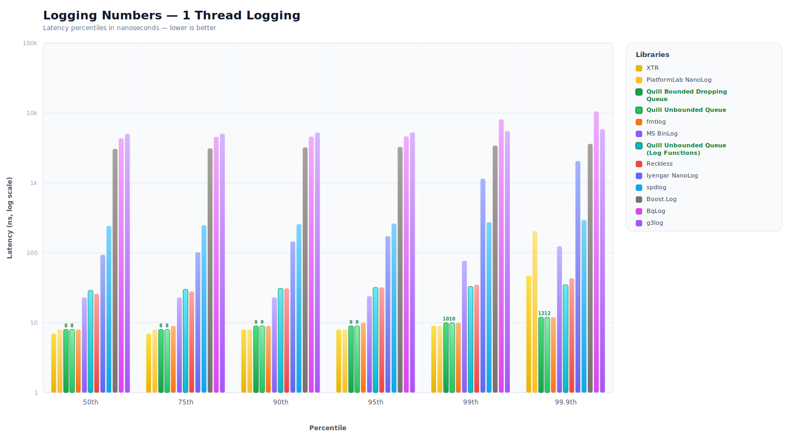
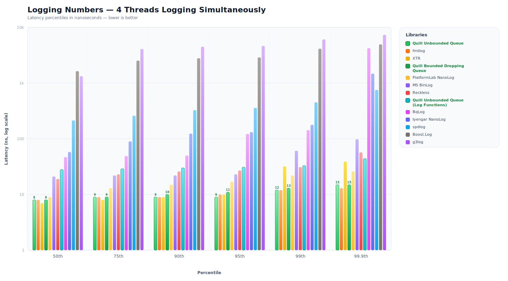
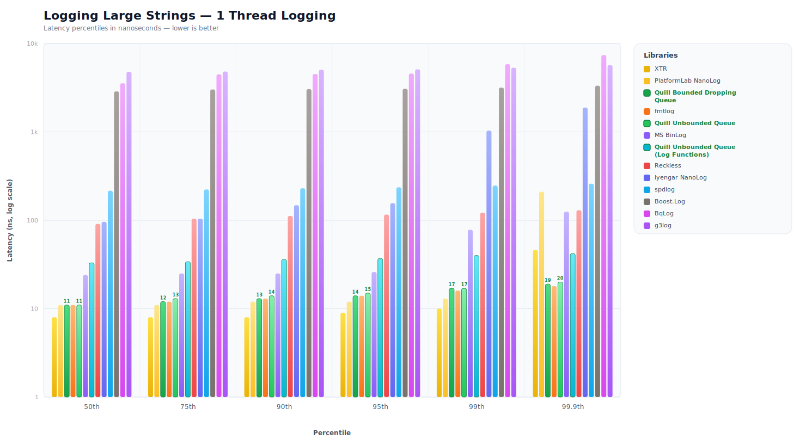
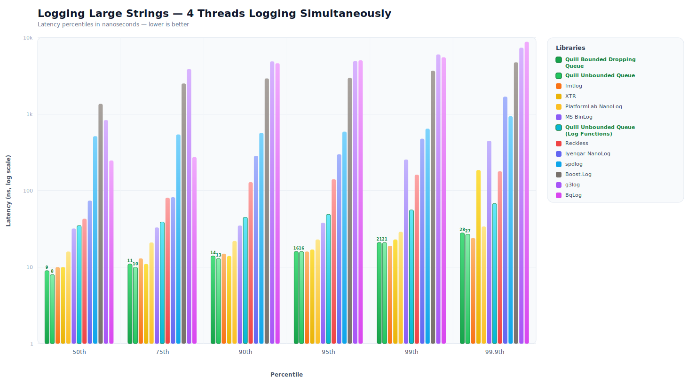
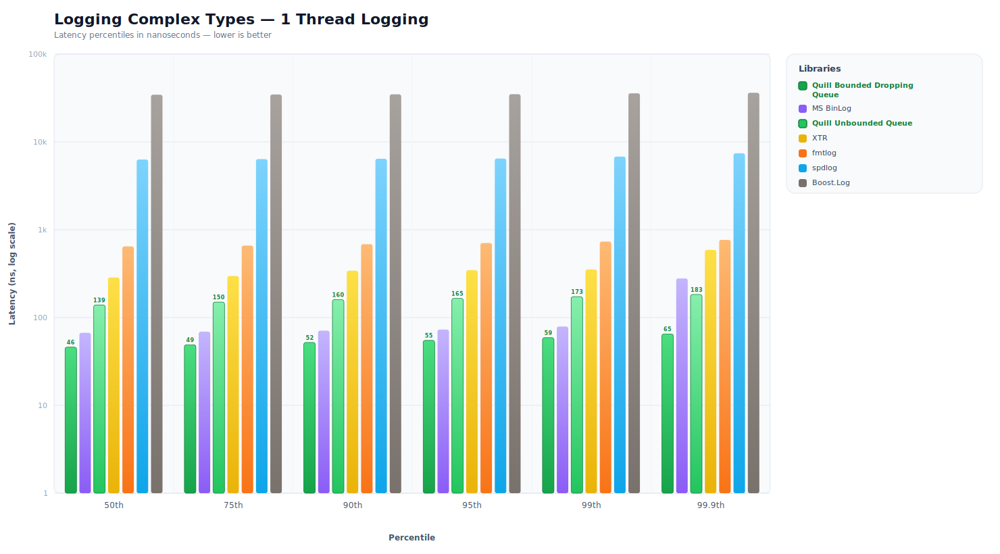
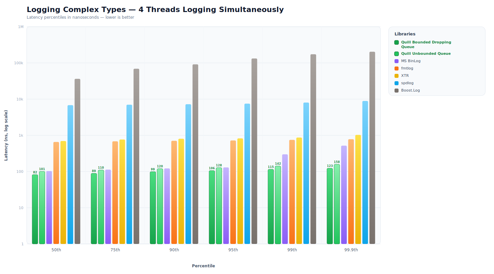
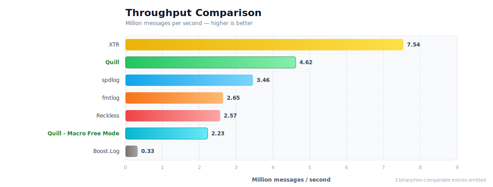
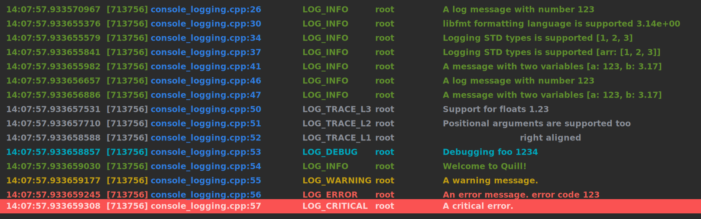

<div align="center">
  <!--
  <meta name="description" content="C++ logging library. High-performance, asynchronous logging for low-latency real-time applications.">
  <meta name="keywords" content="C++, logging library, asynchronous logging, high performance, low latency">
  -->

  <h1>
    <br>
    Quill
  </h1>
  <p><b>Asynchronous Low Latency C++ Logging Library</b></p>

  <div>
    <a href="https://github.com/odygrd/quill/actions?query=workflow%3Afedora">
      
    </a>
    <a href="https://github.com/odygrd/quill/actions?query=workflow%3Aubuntu">
      
    </a>
    <a href="https://github.com/odygrd/quill/actions?query=workflow%3Absd">
      
    </a>
    <a href="https://github.com/odygrd/quill/actions?query=workflow%3Amacos">
      
    </a>
    <a href="https://github.com/odygrd/quill/actions?query=workflow%3Awindows">
      
    </a>
    <a href="https://github.com/odygrd/quill/actions?query=workflow%3Aintelllvm">
      
    </a>
  </div>

  <div>
    <a href="https://codecov.io/gh/odygrd/quill">
      
    </a>
    <a href="https://github.com/odygrd/quill/actions/workflow/status/odygrd/quill/fuzz.yml">
      
    </a>
    <a href="https://app.codacy.com/gh/odygrd/quill/dashboard?utm_source=gh&utm_medium=referral&utm_content=&utm_campaign=Badge_grade">
      
    </a>
    <a href="https://www.codefactor.io/repository/github/odygrd/quill">
      
    </a>
  </div>

  <div>
    <a href="https://opensource.org/licenses/MIT">
      
    </a>
    <a href="https://en.wikipedia.org/wiki/C%2B%2B17">
      
    </a>
  </div>

  <h4>
    <a href="https://godbolt.org/z/n68asK7bY" title="Try Quill live on Compiler Explorer">🔬 Try It Online</a>
    <span> · </span>
    <a href="https://quillcpp.readthedocs.io" title="Explore the full documentation">📚 Documentation</a>
    <span> · </span>
    <a href="https://quillcpp.readthedocs.io/en/latest/recipes.html" title="Quick reference for common tasks">⚡ Recipes</a>
    <span> · </span>
    <a href="https://quillcpp.readthedocs.io/en/latest/faq.html" title="Frequently asked questions">❓ FAQ</a>
    <span> · </span>
    <a href="https://github.com/odygrd/quill/issues/new?assignees=&labels=&projects=&template=bug-report.md&title=" title="Report a bug or issue">🐛 Report Bug</a>
    <span> · </span>
    <a href="https://github.com/odygrd/quill/issues/new?assignees=&labels=&projects=&template=feature_request.md&title=">💡 Request Feature</a>
  </h4>

  <div align="center"></div>
</div>

---

## 🧭 Table of Contents

- [Introduction](#-introduction)
- [Quick Start](#-quick-start)
- [Features](#-features)
- [Performance](#-performance)
- [Usage](#-usage)
- [Design](#-design)
- [Caveats](#-caveats)
- [License](#-license)

---

## ✨ Introduction

**Quill** is a **high-performance asynchronous logging library** written in **C++**. It is designed for low-latency,
performance-critical applications where every microsecond counts.

- **Performance-Focused**: Quill consistently outperforms many popular logging libraries.
- **Feature-Rich**: Packed with advanced features to meet diverse logging needs.
- **Metric Publishing**: Publish pre-registered metric samples to Prometheus, StatsD, OpenTelemetry, or any in-process
  collector through the same asynchronous backend used for logs. See
  the [Metrics guide](https://quillcpp.readthedocs.io/en/latest/metrics.html).
- **Battle-Tested**: Proven in demanding production environments. Extensively tested with sanitizers (ASan, UBSan, LSan)
  and fuzzed across a wide range of inputs.
- **Extensive Documentation**: Comprehensive guides and examples available.
- **Community-Driven**: Open to contributions, feedback, and feature requests.

Try it on [Compiler Explorer](https://godbolt.org/z/n68asK7bY)

---

## ⏩ Quick Start

Getting started is easy and straightforward. Follow these steps to integrate the library into your project:

### Installation

You can install Quill using the package manager of your choice:

| Package Manager |              Installation Command              |
|:---------------:|:----------------------------------------------:|
|      vcpkg      |             `vcpkg install quill`              |
|      Conan      |             `conan install quill`              |
|    Homebrew     |              `brew install quill`              |
|  Meson WrapDB   |           `meson wrap install quill`           |
|      Conda      |      `conda install -c conda-forge quill`      |
|     Bzlmod      | `bazel_dep(name = "quill", version = "x.y.z")` |
|      xmake      |             `xrepo install quill`              |
|       nix       |            `nix-shell -p quill-log`            |
|     build2      |                   `libquill`                   |

### Setup

#### Quickest Setup

For the shortest path from zero to working logs, use `simple_logger()`:

```c++
#include "quill/SimpleSetup.h"
#include "quill/LogMacros.h"

int main()
{
  // log to the console
  auto* logger = quill::simple_logger();
  LOG_INFO(logger, "Hello from {}!", "Quill");

  // log to a file
  auto* logger2 = quill::simple_logger("test.log");
  LOG_WARNING(logger2, "This message goes to a file");
}
```

**Console output:**

```
20:07:18.423476231 [48917] main.cpp:8                    LOG_INFO      Hello from Quill!
```

#### Detailed Setup

If you want explicit control over backend options, logger names, sinks, or formatters, use the
`Backend` and `Frontend` APIs directly:

```c++
#include "quill/Backend.h"
#include "quill/Frontend.h"
#include "quill/LogMacros.h"
#include "quill/Logger.h"
#include "quill/sinks/ConsoleSink.h"
#include <string_view>

int main()
{
  quill::Backend::start();

  quill::Logger* logger = quill::Frontend::create_or_get_logger(
    "root", quill::Frontend::create_or_get_sink<quill::ConsoleSink>("sink_id_1"));

  LOG_INFO(logger, "Hello from {}!", std::string_view{"Quill"});
}
```

**Output:**

```
20:07:18.423476231 [48917] main.cpp:15                   LOG_INFO      root         Hello from Quill!
```

You can also use the macro-free mode. The macro API (`LOG_INFO`) is the lowest-latency path.
The function API (`quill::info`) reads more like ordinary code but is slightly slower.
See [here](https://quillcpp.readthedocs.io/en/latest/macro_free_mode.html) for the trade-offs.

```c++
#include "quill/Backend.h"
#include "quill/Frontend.h"
#include "quill/LogFunctions.h"
#include "quill/Logger.h"
#include "quill/sinks/ConsoleSink.h"
#include <string_view>

int main()
{
  quill::Backend::start();

  quill::Logger* logger = quill::Frontend::create_or_get_logger(
    "root", quill::Frontend::create_or_get_sink<quill::ConsoleSink>("sink_id_1"));

  quill::info(logger, "Hello from {}!", std::string_view{"Quill"});
}
```

### Publishing Metrics

Register `MetricMetadata` once, then publish `double` samples from hot threads through the same asynchronous backend
used for logs. The bundled `PrometheusSink` handles counters, gauges, histograms, and summaries; custom sinks can route
samples to StatsD, OpenTelemetry, or any in-process collector via `Sink::write_metric()`.

```c++
// One-time registration — returns a stable pointer valid for program lifetime.
quill::MetricMetadata const* requests_total = quill::Frontend::create_metric(
  "requests_total_post_200", "requests_total", {{"method", "POST"}, {"status", "200"}});

// Hot path — no label serialization, just a pointer and a double.
logger->publish_metric(requests_total, 1.0);
```

See the [Metrics guide](https://quillcpp.readthedocs.io/en/latest/metrics.html) for sink setup, custom sinks, and
Prometheus integration.

---

## 🎯 Features

- **High-Performance**: Ultra-low latency performance.
- **Asynchronous Processing**: Background thread handles formatting and I/O, keeping your main thread responsive.
- **Metric Publishing**: Publish pre-registered metric samples to Prometheus, StatsD, OpenTelemetry, or any in-process
  collector through the same asynchronous backend.
  See [Metrics](https://quillcpp.readthedocs.io/en/latest/metrics.html).
- **Minimal Header Includes**:
  - **Frontend**: Only `Logger.h` and `LogMacros.h` needed for logging. Lightweight with minimal dependencies.
  - **Backend**: Single `.cpp` file inclusion. No backend code injection into other translation units.
- **Compile-Time Optimization**: Eliminate specific log levels at compile time.
- **Custom Formatters**: Define your own log output patterns.
  See [Formatters](https://quillcpp.readthedocs.io/en/latest/formatters.html).
- **Timestamp-Ordered Logs**: Simplify debugging of multithreaded applications with chronologically ordered logs.
- **Flexible Timestamps**: Support for `rdtsc`, `chrono`, or `custom clocks` - ideal for simulations and more.
- **Backtrace Logging**: Store messages in a ring buffer for on-demand display.
  See [Backtrace Logging](https://quillcpp.readthedocs.io/en/latest/backtrace_logging.html)
- **Multiple Output Sinks**: Console (with color), files (with rotation), JSON, ability to create custom sinks and more.
- **Log Filtering**: Process only relevant messages.
  See [Filters](https://quillcpp.readthedocs.io/en/latest/filters.html).
- **JSON Logging**: Structured log output.
  See [JSON Logging](https://quillcpp.readthedocs.io/en/latest/json_logging.html)
- **Mapped Diagnostic Context (MDC)**: Thread-local key/value context attached automatically to subsequent log lines.
  See [MDC](https://quillcpp.readthedocs.io/en/latest/mdc.html).
- **Rate-Limited Macros**: `LOG_*_LIMIT` / `LOGV_*_LIMIT` emit at most once per configured interval per call site.
- **Configurable Queue Modes**: `bounded/unbounded` and `blocking/dropping` options with monitoring on dropped messages,
  queue reallocations, and blocked hot threads.
- **Crash Handling**: Built-in signal handler for log preservation during crashes.
- **Huge Pages Support (Linux)**: Leverage huge pages on the hot path for optimized performance.
- **Wide Character Support (Windows)**: Logs wide strings by converting them to UTF-8 on the backend, with support for
  STL containers consisting of wide strings.
- **Exception-Free Option**: Configurable builds with or without exception handling.
- **Clean Codebase**: Maintained to high standards, warning-free even at strict levels.
- **Type-Safe API**: Built on [{fmt}](https://github.com/fmtlib/fmt) library.

---

## 🚀 Performance

### System Configuration

- **OS:** Linux RHEL 9.4
- **CPU:** Intel Core i5-12600 (12th Gen) @ 4.8 GHz
- **Compiler:** GCC 13.1
- **Benchmark-Tuned System:** The system is specifically tuned for benchmarking.

- **Command Line Parameters:**
  ```shell
  $ cat /proc/cmdline
  BOOT_IMAGE=(hd0,gpt2)/vmlinuz-5.14.0-427.13.1.el9_4.x86_64 root=/dev/mapper/rhel-root ro crashkernel=1G-4G:192M,4G-64G:256M,64G-:512M resume=/dev/mapper/rhel-swap rd.lvm.lv=rhel/root rd.lvm.lv=rhel/swap rhgb quiet nohz=on nohz_full=1-5 rcu_nocbs=1-5 isolcpus=1-5 mitigations=off transparent_hugepage=never intel_pstate=disable nosoftlockup irqaffinity=0 processor.max_cstate=1 nosoftirqd sched_tick_offload=0 spec_store_bypass_disable=off spectre_v2=off iommu=pt
  ```

You can find the benchmark code on the [logger_benchmarks](https://github.com/odygrd/logger_benchmarks) repository.

### Latency

The results presented in the tables below are measured in `nanoseconds (ns)`.

The tables are sorted by the 95th percentile (lower is better).

#### Logging Numbers

`LOG_INFO(logger, "Logging int: {}, int: {}, double: {}", i, j, d)`.

##### 1 Thread Logging

| Library                                                                  | 50th | 75th | 90th | 95th | 99th | 99.9th |
|--------------------------------------------------------------------------|:----:|:----:|:----:|:----:|:----:|:------:|
| [XTR](https://github.com/choll/xtr)                                      |  7   |  7   |  8   |  8   |  9   |   47   |
| [PlatformLab NanoLog](https://github.com/PlatformLab/NanoLog)            |  8   |  8   |  8   |  8   |  9   |  203   |
| [Quill Bounded Dropping Queue](https://github.com/odygrd/quill)          |  8   |  8   |  9   |  9   |  10  |   12   |
| [Quill Unbounded Queue](https://github.com/odygrd/quill)                 |  8   |  8   |  9   |  9   |  10  |   12   |
| [fmtlog](https://github.com/MengRao/fmtlog)                              |  8   |  9   |  9   |  10  |  10  |   12   |
| [MS BinLog](https://github.com/Morgan-Stanley/binlog)                    |  23  |  23  |  23  |  24  |  77  |  124   |
| [Quill Unbounded Queue (Log Functions)](https://github.com/odygrd/quill) |  29  |  30  |  31  |  32  |  33  |   35   |
| [Reckless](https://github.com/mattiasflodin/reckless)                    |  26  |  28  |  31  |  32  |  35  |   43   |
| [Iyengar NanoLog](https://github.com/Iyengar111/NanoLog)                 |  94  | 102  | 145  | 173  | 1149 |  2054  |
| [spdlog](https://github.com/gabime/spdlog)                               | 242  | 249  | 257  | 262  | 274  |  294   |
| [Boost.Log](https://www.boost.org)                                       | 3057 | 3111 | 3221 | 3261 | 3409 |  3612  |
| [BqLog](https://github.com/Tencent/BqLog)                                | 4340 | 4564 | 4588 | 4618 | 8089 | 10536  |
| [g3log](https://github.com/KjellKod/g3log)                               | 5017 | 5055 | 5239 | 5289 | 5503 |  5876  |



##### 4 Threads Logging Simultaneously

| Library                                                                  | 50th | 75th | 90th | 95th | 99th | 99.9th |
|--------------------------------------------------------------------------|:----:|:----:|:----:|:----:|:----:|:------:|
| [Quill Bounded Dropping Queue](https://github.com/odygrd/quill)          |  13  |  13  |  14  |  14  |  17  |   23   |
| [Quill Unbounded Queue](https://github.com/odygrd/quill)                 |  11  |  11  |  13  |  14  |  15  |   21   |
| [fmtlog](https://github.com/MengRao/fmtlog)                              |  14  |  14  |  15  |  15  |  16  |   19   |
| [XTR](https://github.com/choll/xtr)                                      |  12  |  13  |  14  |  15  |  18  |  192   |
| [PlatformLab NanoLog](https://github.com/PlatformLab/NanoLog)            |  15  |  15  |  16  |  16  |  20  |   24   |
| [MS BinLog](https://github.com/Morgan-Stanley/binlog)                    |  32  |  33  |  34  |  36  | 253  |  447   |
| [Quill Unbounded Queue (Log Functions)](https://github.com/odygrd/quill) |  36  |  40  |  45  |  47  |  52  |   61   |
| [Reckless](https://github.com/mattiasflodin/reckless)                    |  29  |  35  |  45  |  52  |  66  |   91   |
| [Iyengar NanoLog](https://github.com/Iyengar111/NanoLog)                 |  75  |  81  | 285  | 298  | 473  |  1721  |
| [spdlog](https://github.com/gabime/spdlog)                               | 528  | 555  | 585  | 607  | 669  |  973   |
| [Boost.Log](https://www.boost.org)                                       | 1600 | 2705 | 3126 | 3159 | 3816 |  4958  |
| [BqLog](https://github.com/Tencent/BqLog)                                | 249  | 276  | 4595 | 5152 | 5505 |  8711  |
| [g3log](https://github.com/KjellKod/g3log)                               | 1192 | 4236 | 5165 | 5214 | 6443 |  7844  |



#### Logging Large Strings

Logging `std::string` over 35 characters to prevent the short string optimization.

`LOG_INFO(logger, "Logging int: {}, int: {}, string: {}", i, j, large_string)`.

##### 1 Thread Logging

| Library                                                                  | 50th | 75th | 90th | 95th | 99th | 99.9th |
|--------------------------------------------------------------------------|:----:|:----:|:----:|:----:|:----:|:------:|
| [XTR](https://github.com/choll/xtr)                                      |  8   |  8   |  8   |  9   |  10  |   46   |
| [PlatformLab NanoLog](https://github.com/PlatformLab/NanoLog)            |  11  |  11  |  12  |  12  |  13  |  210   |
| [Quill Bounded Dropping Queue](https://github.com/odygrd/quill)          |  11  |  12  |  13  |  14  |  17  |   19   |
| [fmtlog](https://github.com/MengRao/fmtlog)                              |  11  |  12  |  13  |  14  |  16  |   18   |
| [Quill Unbounded Queue](https://github.com/odygrd/quill)                 |  11  |  13  |  14  |  15  |  17  |   20   |
| [MS BinLog](https://github.com/Morgan-Stanley/binlog)                    |  24  |  25  |  25  |  26  |  78  |  125   |
| [Quill Unbounded Queue (Log Functions)](https://github.com/odygrd/quill) |  33  |  34  |  36  |  37  |  40  |   42   |
| [Reckless](https://github.com/mattiasflodin/reckless)                    |  91  | 104  | 112  | 116  | 122  |  130   |
| [Iyengar NanoLog](https://github.com/Iyengar111/NanoLog)                 |  96  | 104  | 148  | 156  | 1034 |  1883  |
| [spdlog](https://github.com/gabime/spdlog)                               | 216  | 223  | 230  | 236  | 247  |  259   |
| [Boost.Log](https://www.boost.org)                                       | 2871 | 3020 | 3045 | 3078 | 3169 |  3329  |
| [BqLog](https://github.com/Tencent/BqLog)                                | 3549 | 4482 | 4517 | 4576 | 5837 |  7392  |
| [g3log](https://github.com/KjellKod/g3log)                               | 4785 | 4822 | 5049 | 5099 | 5319 |  5688  |



##### 4 Threads Logging Simultaneously

| Library                                                                  | 50th | 75th | 90th | 95th | 99th | 99.9th |
|--------------------------------------------------------------------------|:----:|:----:|:----:|:----:|:----:|:------:|
| [Quill Bounded Dropping Queue](https://github.com/odygrd/quill)          |  9   |  11  |  14  |  16  |  21  |   28   |
| [Quill Unbounded Queue](https://github.com/odygrd/quill)                 |  8   |  10  |  13  |  16  |  21  |   27   |
| [fmtlog](https://github.com/MengRao/fmtlog)                              |  10  |  13  |  15  |  16  |  19  |   24   |
| [XTR](https://github.com/choll/xtr)                                      |  10  |  11  |  14  |  17  |  23  |  186   |
| [PlatformLab NanoLog](https://github.com/PlatformLab/NanoLog)            |  16  |  21  |  22  |  23  |  29  |   34   |
| [MS BinLog](https://github.com/Morgan-Stanley/binlog)                    |  32  |  33  |  35  |  38  | 255  |  449   |
| [Quill Unbounded Queue (Log Functions)](https://github.com/odygrd/quill) |  35  |  39  |  45  |  49  |  56  |   68   |
| [Reckless](https://github.com/mattiasflodin/reckless)                    |  43  |  81  | 129  | 141  | 162  |  179   |
| [Iyengar NanoLog](https://github.com/Iyengar111/NanoLog)                 |  74  |  82  | 285  | 299  | 478  |  1693  |
| [spdlog](https://github.com/gabime/spdlog)                               | 515  | 543  | 570  | 591  | 646  |  939   |
| [Boost.Log](https://www.boost.org)                                       | 1363 | 2518 | 2931 | 2977 | 3686 |  4756  |
| [g3log](https://github.com/KjellKod/g3log)                               | 837  | 3885 | 4900 | 4947 | 6040 |  7397  |
| [BqLog](https://github.com/Tencent/BqLog)                                | 248  | 275  | 4634 | 5055 | 5538 |  8843  |



#### Logging Complex Types

Logging `std::vector<std::string>` containing 16 large strings, each ranging from 50 to 60 characters.

Note: some of the previous loggers do not support passing a `std::vector` as an argument.

`LOG_INFO(logger, "Logging int: {}, int: {}, vector: {}", i, j, v)`.

##### 1 Thread Logging

| Library                                                         | 50th  | 75th  | 90th  | 95th  | 99th  | 99.9th |
|-----------------------------------------------------------------|:-----:|:-----:|:-----:|:-----:|:-----:|:------:|
| [Quill Bounded Dropping Queue](https://github.com/odygrd/quill) |  56   |  58   |  61   |  63   |  68   |   94   |
| [MS BinLog](https://github.com/Morgan-Stanley/binlog)           |  73   |  76   |  78   |  79   |  87   |  354   |
| [Quill Unbounded Queue](https://github.com/odygrd/quill)        |  137  |  150  |  164  |  171  |  181  |  189   |
| [XTR](https://github.com/choll/xtr)                             |  309  |  314  |  319  |  322  |  349  |  666   |
| [fmtlog](https://github.com/MengRao/fmtlog)                     |  750  |  788  |  823  |  847  |  896  |  982   |
| [spdlog](https://github.com/gabime/spdlog)                      | 6749  | 6833  | 6911  | 6967  | 7217  |  7863  |
| [Boost.Log](https://www.boost.org)                              | 90879 | 91012 | 91164 | 91251 | 92676 | 93069  |



##### 4 Threads Logging Simultaneously

| Library                                                         | 50th  | 75th  | 90th  |  95th  |  99th  | 99.9th |
|-----------------------------------------------------------------|:-----:|:-----:|:-----:|:------:|:------:|:------:|
| [Quill Bounded Dropping Queue](https://github.com/odygrd/quill) |  82   |  89   |  99   |  106   |  115   |  123   |
| [Quill Unbounded Queue](https://github.com/odygrd/quill)        |  101  |  110  |  120  |  128   |  142   |  158   |
| [MS BinLog](https://github.com/Morgan-Stanley/binlog)           |  103  |  113  |  122  |  130   |  299   |  518   |
| [fmtlog](https://github.com/MengRao/fmtlog)                     |  657  |  683  |  707  |  722   |  750   |  782   |
| [XTR](https://github.com/choll/xtr)                             |  697  |  766  |  805  |  825   |  870   |  1027  |
| [spdlog](https://github.com/gabime/spdlog)                      | 6822  | 7021  | 7230  |  7513  |  8048  |  8903  |
| [Boost.Log](https://www.boost.org)                              | 36382 | 69081 | 91568 | 132626 | 173810 | 203865 |



The benchmark methodology involves logging 20 messages in a loop, calculating and storing the average latency for those
20 messages, then waiting around ~2 milliseconds, and repeating this process for a specified number of iterations.

_In the `Quill Bounded Dropping` benchmarks, the dropping queue size is set to `262,144` bytes, which is double the
default size of `131,072` bytes._

### Throughput

Throughput is measured by calculating the maximum number of log messages the backend logging thread can write to a log
file per second (higher is better).

The tests were run on the same system used for the latency benchmarks.

Although Quill’s primary focus is not on maximizing throughput, it efficiently manages log messages across multiple
threads. Benchmarking throughput of asynchronous logging libraries presents certain challenges. Some libraries may drop
log messages, leading to smaller-than-expected log files, while others only provide asynchronous flushing, making it
difficult to verify when the backend thread has fully processed all messages.

For comparison, we benchmark against other asynchronous logging libraries that offer guaranteed logging with a
flush-and-wait mechanism.

Note that `MS BinLog` writes log data to a binary file, which requires offline formatting with an additional
program—this makes it an unfair comparison, but it is included for reference.

Similarly, `BqLog (binary log)` uses the compressed binary log appender, and its log files are not human-readable unless
processed offline. However, it is included for reference. The other version of `BqLog` is using a text appender and
produces human-readable log files.

In the same way, `Platformlab Nanolog` also outputs binary logs and is expected to deliver high throughput. However, for
reasons unexplained, the benchmark runs significantly slower (10x longer) than the other libraries, so it is excluded
from the table.

`XTR` uses ``FMT_COMPILE`` for message formatting in this benchmark. Quill does not currently use that optimisation:
decoded arguments are formatted through the runtime ``fmt`` APIs, and the final log line then passes through Quill's
runtime-configurable ``PatternFormatter``.

Logging 4 million times the message `"Iteration: {} int: {} double: {}"`

| Library                                                            | million msg/second | elapsed time |
|--------------------------------------------------------------------|:------------------:|:------------:|
| [MS BinLog (binary log)](https://github.com/Morgan-Stanley/binlog) |       57.72        |    69 ms     |
| [BqLog (binary log)](https://github.com/Tencent/BqLog)             |       13.85        |    288 ms    |
| [XTR](https://github.com/choll/xtr)                                |        7.54        |    530 ms    |
| [BqLog](https://github.com/Tencent/BqLog)                          |        5.40        |    740 ms    |
| [Quill](https://github.com/odygrd/quill)                           |        4.62        |    866 ms    |
| [spdlog](https://github.com/gabime/spdlog)                         |        3.46        |   1156 ms    |
| [fmtlog](https://github.com/MengRao/fmtlog)                        |        2.65        |   1508 ms    |
| [Reckless](https://github.com/mattiasflodin/reckless)              |        2.57        |   1555 ms    |
| [Quill - Macro Free Mode](https://github.com/odygrd/quill)         |        2.23        |   1789 ms    |
| [Boost.Log](https://www.boost.org)                                 |        0.33        |   12152 ms   |



### Compilation Time

Compile times are measured on the system above using clean `Release` builds of [
`BENCHMARK_quill_compile_time`](https://github.com/odygrd/quill/blob/master/benchmarks/compile_time/compile_time_bench.cpp),
which compiles `2000` auto-generated log statements with varied argument types.

The measurements below were taken with `-march=x86-64-v3` for `Release`, running one clean build
at a time with `-j4`.
Clang builds additionally enable `-ftime-trace`.

Quill intentionally keeps call-site metadata such as file, line, format string, and tags out of the
frontend template identity. In the common macro-based path, that information is stored in a
`MacroMetadata` object and passed as a regular function argument. As a result, multiple log statements
with the same argument type pack can reuse the same `log_statement` instantiation; changing only the
call-site metadata does not create a new frontend template instantiation.

| Compiler       | Clean Build Time | Benchmark Binary | Main TU Object |
|:---------------|-----------------:|-----------------:|---------------:|
| `clang 17.0.6` |        `30.64 s` |        `5.87 MB` |     `10.10 MB` |
| `gcc 13.3.1`   |        `61.20 s` |        `6.22 MB` |      `9.28 MB` |

**Header include profile** — shows the additional headers pulled in when logging, following
the [recommended_usage](https://github.com/odygrd/quill/blob/master/examples/recommended_usage/recommended_usage.cpp)
example:

> [**Open in Speedscope
** ↗](https://www.speedscope.app/#profileURL=https://raw.githubusercontent.com/odygrd/quill/master/docs/traces/recommended_usage.cpp.json)

**Compile-time benchmark** — measures compilation
of [2000 auto-generated log statements](https://github.com/odygrd/quill/blob/master/benchmarks/compile_time/compile_time_bench.cpp)
with various arguments:

> [**Open in Speedscope
** ↗](https://www.speedscope.app/#profileURL=https://raw.githubusercontent.com/odygrd/quill/master/docs/traces/compile_time_bench.cpp.json)

To generate these profiles yourself:

```bash
cmake -G Ninja -DCMAKE_CXX_COMPILER=clang++ -DCMAKE_BUILD_TYPE=Release \
  -DQUILL_BUILD_BENCHMARKS=ON -DQUILL_ENABLE_TIME_TRACE=ON \
  -DCMAKE_CXX_FLAGS='-march=x86-64-v3' ..
cmake --build . --target BENCHMARK_quill_compile_time -j 4
# Load the resulting .cpp.json files into https://www.speedscope.app
```

### Verdict

Quill excels in hot path latency benchmarks and supports high throughput, offering a rich set of features that outshines
other logging libraries.

The human-readable log files facilitate easier debugging and analysis. While initially larger, they compress
efficiently, with the size difference between human-readable and binary logs becoming minimal once zipped.

For example, for the same amount of messages:

```
ms_binlog_backend_total_time.blog (binary log): 177 MB
ms_binlog_backend_total_time.zip (zipped binary log): 35 MB
```

```
quill_backend_total_time.log (human-readable log): 448 MB
quill_backend_total_time.zip (zipped human-readable log): 47 MB
```

If you prefer a binary-log workflow, MS BinLog is a strong alternative. It delivers excellent hot-path latency and
smaller raw files, but it trades away immediate readability and requires offline processing tools.

---

## 🧩 Usage

Also, see the [Quick Start Guide](https://quillcpp.readthedocs.io/en/latest/quick_start.html) for a brief introduction.

```c++
#include "quill/Backend.h"
#include "quill/Frontend.h"
#include "quill/LogMacros.h"
#include "quill/Logger.h"
#include "quill/sinks/ConsoleSink.h"
#include "quill/std/Array.h"

#include <string>
#include <utility>

int main()
{
  // Backend  
  quill::BackendOptions backend_options;
  quill::Backend::start(backend_options);

  // Frontend
  auto console_sink = quill::Frontend::create_or_get_sink<quill::ConsoleSink>("sink_id_1");
  quill::Logger* logger = quill::Frontend::create_or_get_logger("root", std::move(console_sink));

  // Change the LogLevel to print everything
  logger->set_log_level(quill::LogLevel::TraceL3);

  // A log message with number 123
  int a = 123;
  std::string l = "log";
  LOG_INFO(logger, "A {} message with number {}", l, a);

  // libfmt formatting language is supported 3.14e+00
  double pi = 3.141592653589793;
  LOG_INFO(logger, "libfmt formatting language is supported {:.2e}", pi);

  // Logging STD types is supported [1, 2, 3]
  std::array<int, 3> arr = {1, 2, 3};
  LOG_INFO(logger, "Logging STD types is supported {}", arr);

  // Logging STD types is supported [arr: [1, 2, 3]]
  LOGV_INFO(logger, "Logging STD types is supported", arr);

  // A message with two variables [a: 123, b: 3.17]
  double b = 3.17;
  LOGV_INFO(logger, "A message with two variables", a, b);

  for (uint32_t i = 0; i < 10; ++i)
  {
    // Will only log the message once per second
    LOG_INFO_LIMIT(std::chrono::seconds{1}, logger, "A {} message with number {}", l, a);
    LOGV_INFO_LIMIT(std::chrono::seconds{1}, logger, "A message with two variables", a, b);
  }

  LOG_TRACE_L3(logger, "Support for floats {:03.2f}", 1.23456);
  LOG_TRACE_L2(logger, "Positional arguments are {1} {0} ", "too", "supported");
  LOG_TRACE_L1(logger, "{:>30}", std::string_view {"right aligned"});
  LOG_DEBUG(logger, "Debugging foo {}", 1234);
  LOG_INFO(logger, "Welcome to Quill!");
  LOG_WARNING(logger, "A warning message.");
  LOG_ERROR(logger, "An error message. error code {}", 123);
  LOG_CRITICAL(logger, "A critical error.");
}
```

### Output



### External CMake

#### Building and Installing Quill

To get started with Quill, clone the repository and install it using CMake:

```bash
git clone https://github.com/odygrd/quill.git
cd quill
mkdir cmake_build
cd cmake_build
cmake ..
make install
```

- **Custom Installation**: Specify a custom directory with `-DCMAKE_INSTALL_PREFIX=/path/to/install/dir`.
- **Build Examples**: Include examples with `-DQUILL_BUILD_EXAMPLES=ON`.

Next, add Quill to your project using `find_package()`:

```cmake
find_package(quill REQUIRED)
target_link_libraries(your_target PUBLIC quill::quill)
```

#### Sample Directory Structure

Organize your project directory like this:

```
my_project/
├── CMakeLists.txt
├── main.cpp
```

#### Sample CMakeLists.txt

Here is a minimal `CMakeLists.txt`:

```cmake
# If Quill is in a non-standard directory, specify its path.
set(CMAKE_PREFIX_PATH /path/to/quill)

# Find and link the Quill library.
find_package(quill REQUIRED)
add_executable(example main.cpp)
target_link_libraries(example PUBLIC quill::quill)
```

### Embedded CMake

If you prefer to vendor Quill directly, add it as a subdirectory:

#### Sample Directory Structure

```
my_project/
├── quill/            # Quill repo folder
├── CMakeLists.txt
├── main.cpp
```

#### Sample CMakeLists.txt

Use this `CMakeLists.txt` to include Quill directly:

```cmake
cmake_minimum_required(VERSION 3.8)
project(my_project)

set(CMAKE_CXX_STANDARD 17)
set(CMAKE_CXX_STANDARD_REQUIRED ON)

add_subdirectory(quill)
add_executable(my_project main.cpp)
target_link_libraries(my_project PUBLIC quill::quill)
```

### Android NDK

Android usually works without special handling. If your toolchain does not support thread names,
configure with:

```bash
-DQUILL_NO_THREAD_NAME_SUPPORT:BOOL=ON
```

For timestamps, use `quill::ClockSourceType::System`. Quill also includes an `AndroidSink` for
Android's logging system.

#### Minimal Example to Start Logging on Android

```c++
quill::Backend::start();

auto sink = quill::Frontend::create_or_get_sink<quill::AndroidSink>("app", [](){
    quill::AndroidSinkConfig asc;
    asc.set_tag("app");
    asc.set_format_message(true);
    return asc;
}());

auto logger = quill::Frontend::create_or_get_logger("root", std::move(sink),
                                                    quill::PatternFormatterOptions {}, 
                                                    quill::ClockSourceType::System);

LOG_INFO(logger, "Test {}", 123);
```

### Meson

#### Using WrapDB

Install Quill from Meson's `wrapdb` with:

```bash
meson wrap install quill
```

#### Manual Integration

Or copy the repository into `subprojects` and add the following to `meson.build`:

```meson
quill = subproject('quill')
quill_dep = quill.get_variable('quill_dep')
my_build_target = executable('name', 'main.cpp', dependencies : [quill_dep], install : true)
```

### Bazel

#### Using Bzlmod

Quill is available on `Bzlmod`.

#### Manual Integration

For manual setup, add Quill to your `BUILD.bazel` file like this:

```bazel
cc_binary(name = "app", srcs = ["main.cpp"], deps = ["//quill_path:quill"])
```

---

## 📐 Design

Quill is split into a **hot frontend** and a **cold backend**.

- Each frontend thread owns a lock-free SPSC queue. `LOG_*` macros binary-serialize arguments
  directly into that queue — no shared state, no contention between threads, no formatting work
  on the caller.
- A single backend worker drains all queues, merges events in timestamp order, invokes the
  per-argument-pack decode function to reconstruct arguments, runs `{fmt}` formatting and the
  `PatternFormatter`, and writes the resulting log lines or metric samples to the attached
  `Sink`s.

### Frontend (caller-thread)

When invoking a `LOG_` macro:

1. Creates a static constexpr metadata object containing the format string and source location.

2. Pushes the event into the SPSC lock-free queue. For each log message, Quill enqueues:

| Variable   |                                                  Description                                                   |
|------------|:--------------------------------------------------------------------------------------------------------------:|
| timestamp  |                                               Current timestamp                                                |
| Metadata*  |                                        Pointer to metadata information                                         |
| Logger*    |                                         Pointer to the logger instance                                         |
| DecodeFunc | A pointer to a templated function containing all the log message argument types, used for decoding the message |
| Args...    |           A serialized binary copy of each log message argument that was passed to the `LOG_` macro            |

When invoking `METRIC(...)` or `logger->publish_metric()`:

1. Reuses pre-registered `MetricMetadata`, so metric names and labels are not serialized again on the hot path.

2. Pushes a compact fixed-size sample record to the same SPSC queue.

| Variable        |                              Description                              |
|-----------------|:---------------------------------------------------------------------:|
| timestamp       |                           Current timestamp                           |
| MetricMetadata* |         Pointer to the pre-registered metric name and labels          |
| Logger*         |                    Pointer to the logger instance                     |
| value           | The actual sample value as a `double` (counter delta, latency, gauge) |

### Backend

The backend thread drains the SPSC queue, reconstructs log events, forwards metric samples to
`Sink::write_metric()`, and fans each log or metric event out to the sinks attached to the logger.

### Architecture Overview

The diagram below shows the end-to-end flow from hot frontend threads to the backend worker and sinks.


---

## 🚨 Caveats

**Do not log from destructors of static or global objects.** Quill's internal singletons are
function-local statics destroyed in reverse construction order. If a static object's constructor
triggers the first log call, the library singletons are constructed *after* that object and
destroyed *before* it. Logging from that destructor will then touch already-destroyed state.

**Use `fork()` with care.** Quill starts a background thread, and `fork()` interacts poorly with
multithreaded processes. If you need logging in child processes, call `quill::Backend::start()`
after `fork()` in each process that should log, and write parent and child output to different
files.

Example:

```c++
#include "quill/Backend.h"
#include "quill/Frontend.h"
#include "quill/LogMacros.h"
#include "quill/Logger.h"
#include "quill/sinks/FileSink.h"

int main()
{
  // DO NOT CALL THIS BEFORE FORK
  // quill::Backend::start();

  if (fork() == 0)
  {
    quill::Backend::start();

    // Write child output to its own file.
    auto file_sink = quill::Frontend::create_or_get_sink<quill::FileSink>("child.log");
    
    quill::Logger* logger = quill::Frontend::create_or_get_logger("root", std::move(file_sink));

    LOG_INFO(logger, "Hello from Child {}", 123);
  }
  else
  {
    quill::Backend::start();

    // Write parent output to its own file.
    auto file_sink = quill::Frontend::create_or_get_sink<quill::FileSink>("parent.log");

    quill::Logger* logger = quill::Frontend::create_or_get_logger("root", std::move(file_sink));

    LOG_INFO(logger, "Hello from Parent {}", 123);
  }
}
```

---

## 📝 License

Quill is licensed under the [MIT License](https://opensource.org/licenses/MIT).

Quill depends on third party libraries with separate copyright notices and license terms.
Your use of the source code for these subcomponents is subject to the terms and conditions of the following licenses.

- ([MIT License](https://opensource.org/licenses/MIT)) [{fmt}](https://github.com/fmtlib/fmt/blob/master/LICENSE)
- ([MIT License](https://opensource.org/licenses/MIT)) [doctest](https://github.com/onqtam/doctest/blob/master/LICENSE.txt)
