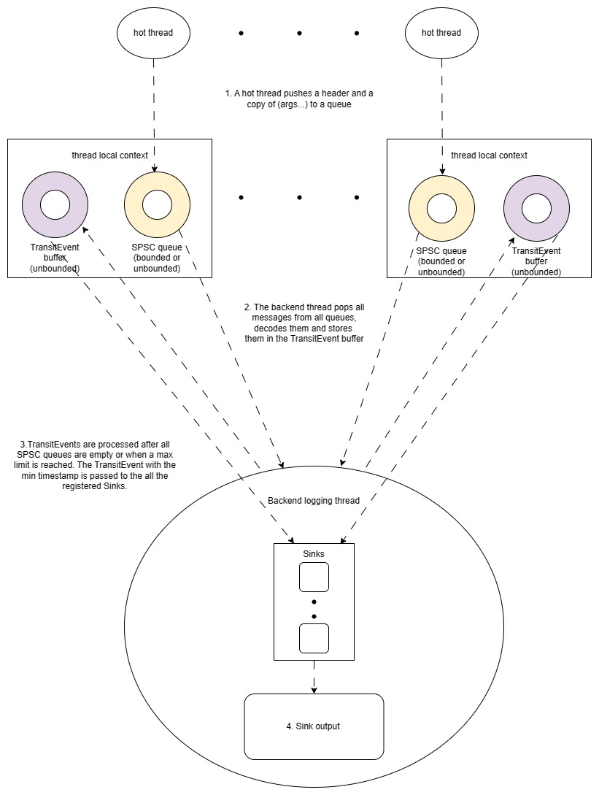

.. title:: Overview

Overview
========

The library adopts asynchronous logging to optimise performance, particularly well-suited for low-latency applications where minimizing hot path latency is crucial, such as trading systems.

A dedicated backend thread manages log formatting and I/O operations, ensuring that even occasional log statements incur minimal overhead.

Thread Safety
-------------

:cpp:class:`quill::Logger` is thread safe by default. The same instance can be used to log by any thread.
Any thread can safely modify the active log level of the logger.

Logging types
-------------

For primitive types, ``std::string``, and ``std::string_view``, the library will perform a deep copy, and all formatting will occur asynchronously in the backend thread.
For standard library types you need to include the relevant file under the ``quill/std`` folder.
For user-defined types you should provide your own function to serialize the type or alternatively convert the type to a string on the hot path for non-latency-sensitive code.
See `user-defined-type-logging-example <https://github.com/odygrd/quill/tree/master/examples/advanced>`_

Reliable Logging Mechanism
--------------------------

Quill utilizes a thread-local single-producer-single-consumer queue to relay logs to the backend thread, ensuring that log messages are never dropped.
Initially, an unbounded queue with a small size is used to optimise performance.
However, if the queue reaches its capacity, a new queue will be allocated, which may cause a slight performance penalty for the frontend.

The default unbounded queue can expand up to a size of 2GB. If this limit is reached, the caller thread will block.
It's possible to change the queue type within the :cpp:class:`quill::FrontendOptions`.

The queue size and type are configurable at runtime by providing a custom :cpp:class:`quill::FrontendOptions` class.

Manual Log Flushing
-------------------

You can explicitly instruct the frontend thread to wait until all log entries up to the current timestamp are flushed
using :cpp:func:`quill::LoggerImpl::flush_log`. The calling thread will **block** until every log statement up to that point has been flushed.

Synchronized Logs for Debugging
-------------------------------

Sometimes, synchronized logging is necessary during application debugging. This can be achieved by configuring the logger to invoke :cpp:func:`quill::LoggerImpl::flush_log` with each log statement using the `QUILL_IMMEDIATE_FLUSH` preprocessor variable.

Enabling `QUILL_IMMEDIATE_FLUSH` causes the calling thread to pause until the log is processed and written to the log file by the backend thread before proceeding, which may have a notable impact on performance.

To enable this behavior, define `QUILL_IMMEDIATE_FLUSH` before including `LogMacros.h` or pass it as a compiler flag.

Handling Application Crashes
----------------------------

During normal program termination, the library ensures all messages are logged as it goes through the ``BackendWorker`` destructor.

However, in the event of an application crash, some log messages may be lost.

To prevent message loss during crashes caused by signal interrupts, users should set up a signal handler and invoke :cpp:func:`quill::LoggerImpl::flush_log` within it.

The library provides a built-in signal handler that ensures crash-safe behavior, which can be enabled via :cpp:func:`quill::Backend::start_with_signal_handler`.

Log Messages Timestamp Order
----------------------------

The library employs a single worker backend thread that orders log messages from all queues by timestamp before printing them to the log file.

Number of Backend Threads
-------------------------

Quill prioritizes low latency over high throughput, hence it utilizes only one backend thread to process all logs efficiently. Multiple backend threads are not supported.

Latency of the First Log Message
--------------------------------

Upon the first log message from each thread, the library allocates a queue dynamically. For minimizing latency with the initial log, consider calling :cpp:func:`quill::FrontendImpl::preallocate`.

Configuration
-------------

Quill offers various customization options, well-documented for ease of use.

- ``Frontend`` configuration is compile-time, requiring a custom :cpp:class:`quill::FrontendOptions` class.
- For ``Backend`` customization, refer to :cpp:class:`quill::BackendOptions`.

Frontend (caller-thread)
------------------------

The frontend is the calling thread on the user side which issues log statements. It includes:

- **Loggers:** A Logger contains a format pattern and can include one or multiple output Sinks.

- **Sinks:** The Sink serves as the output destination, such as a file, console, or other sources.

Log messages are written using macros that accept a logger as their first argument, followed by a format string. The backend utilizes the ``{fmt}`` library for formatting.

When invoking a ``LOG_`` macro:

1. Creates a static constexpr metadata object to store ``Metadata`` such as the format string and source location.

2. Pushes the data to the SPSC lock-free queue. For each log message, the following variables are pushed:

+------------+---------------------------------------------------------------------------------------------------------------+
| Variable   | Description                                                                                                   |
+============+===============================================================================================================+
| timestamp  | Current timestamp                                                                                             |
+------------+---------------------------------------------------------------------------------------------------------------+
| Metadata*  | Pointer to metadata information                                                                               |
+------------+---------------------------------------------------------------------------------------------------------------+
| Logger*    | Pointer to the logger instance                                                                                |
+------------+---------------------------------------------------------------------------------------------------------------+
| DecodeFunc | A pointer to a templated function containing all the log message argument types, used for decoding the message|
+------------+---------------------------------------------------------------------------------------------------------------+
| Args...    | A serialized binary copy of each log message argument that was passed to the ``LOG_`` macro                   |
+------------+---------------------------------------------------------------------------------------------------------------+

Backend
-------

The backend consists of a single backend thread which takes care of formatting the log statements and the IO writing to files.
Consumes each message from the SPSC queue, retrieves all the necessary information, and then formats the message.
Subsequently, forwards the log message to all ``Sinks`` associated with the Logger.

Design
------

